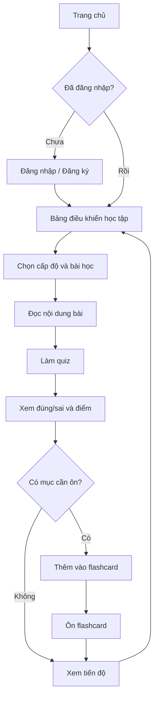
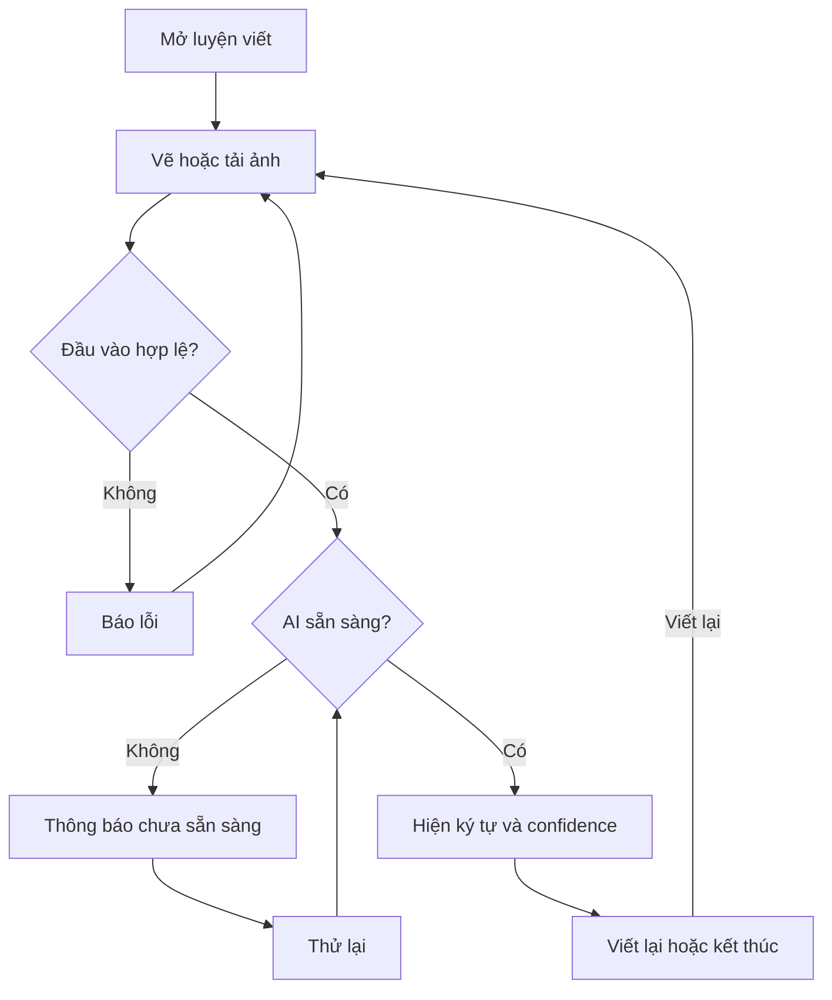
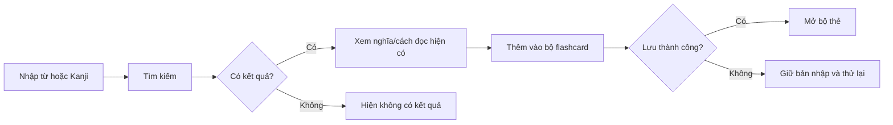
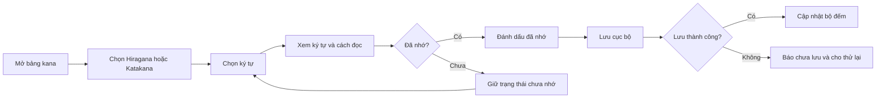

# PRD — MiraiGo: Hệ thống hỗ trợ học tập tiếng Nhật

| Thuộc tính | Giá trị |
| --- | --- |
| Phiên bản | 1.0 |
| Trạng thái | Draft — chờ review |
| Ngày cập nhật | 15/09/2026 |
| Phạm vi | MVP phục vụ đồ án |
| Chủ sở hữu | Nhóm MiraiGo |
| Tài liệu liên quan | `project-brief.md`, `project-context.md`, `decisions-and-sources.md` |

## 1. Tóm tắt

MiraiGo là ứng dụng web hỗ trợ người Việt học tiếng Nhật trong một luồng gồm
học, tra cứu, luyện tập và ôn lại. MVP tập trung vào kana, bài học/quiz, từ vựng
và Kanji, flashcard cá nhân, tiến độ và nhận diện chữ viết bằng AI. Tài liệu này
quy định sản phẩm cần làm và điều kiện xác nhận hoàn thành; cách triển khai chi
tiết thuộc tài liệu kỹ thuật.

## 2. Vấn đề

Người tự học tiếng Nhật thường dùng các công cụ riêng cho kana, từ điển, quiz,
flashcard và luyện viết. Dữ liệu học bị phân tán nên họ khó biết nội dung nào đã
học, trả lời sai hoặc cần ôn lại, đặc biệt với từ vựng và Kanji.

Nhóm chưa thực hiện phỏng vấn hoặc khảo sát chính thức. Nhu cầu về một luồng học
thống nhất hiện là giả thuyết cần kiểm chứng bằng thử nghiệm người dùng, không
phải kết quả nghiên cứu đã xác nhận.

## 3. Mục tiêu và non-goals

| ID | Mục tiêu | Cách xác nhận |
| --- | --- | --- |
| G-01 | Biết phần cần ôn sau luyện tập | Hoàn thành quiz mẫu và xem phản hồi từng câu |
| G-02 | Quản lý nội dung cần nhớ | Tạo, mở lại, ôn và xóa flashcard cá nhân |
| G-03 | Theo dõi hoạt động đã lưu | Đăng nhập lại vẫn xem được tiến độ đã xác nhận lưu |
| G-04 | Nhận gợi ý AI minh bạch | Kết quả hoặc lỗi thể hiện đúng trạng thái và giới hạn |

Non-goals:

- Không cam kết đầy đủ giáo trình/đề thi N5–N1 vì học liệu chưa được kiểm duyệt.
- Không chấm nét hoặc thứ tự nét vì nhận diện ký tự khác với chấm chữ viết.
- Không dùng ảnh người học để huấn luyện AI khi chưa có chính sách dữ liệu.
- Không xây thanh toán, mạng xã hội hoặc bảng xếp hạng trong MVP.

## 4. Người dùng

**U-01 — Người học:** người Việt học tiếng Nhật để thi JLPT, học tập hoặc làm
việc. Họ cần học/tra cứu, luyện tập và quay lại các mục chưa nhớ trên trình duyệt.

**U-02 — Quản trị viên:** thành viên quản lý tài khoản và học liệu trong quyền
được cấp. Quyền chi tiết còn là quyết định mở.

Sản phẩm không tối ưu cho giáo viên quản lý lớp, người cần chứng chỉ chính thức
hoặc trẻ em cần luồng kiểm soát của phụ huynh.

## 5. Yêu cầu sản phẩm

Mỗi yêu cầu dùng user story, ID, priority và tiêu chí chấp nhận. P0 bắt buộc cho
MVP; P1 thực hiện sau khi P0 ổn định. MVP có tối đa chín yêu cầu P0.

### PR-01 — Phiên và quyền truy cập (P0)

**User story:** Là người học, tôi muốn đăng nhập để dùng dữ liệu học tập riêng.

Chấp nhận khi:

- AC-01.1: Thông tin hợp lệ tạo phiên; thông tin sai không tạo phiên.
- AC-01.2: Truy cập dữ liệu bảo vệ khi chưa đăng nhập bị từ chối.
- AC-01.3: Tài khoản A không đọc, sửa hoặc xóa dữ liệu của tài khoản B.
- AC-01.4: Đăng xuất kết thúc phiên trình duyệt và chặn khu vực bảo vệ.
- AC-01.5: Lỗi không làm lộ mật khẩu hoặc token.

### PR-02 — Học kana (P0)

**User story:** Là người mới học, tôi muốn đánh dấu kana đã nhớ để biết phần cần ôn.

Chấp nhận khi:

- AC-02.1: Chọn ký tự hiển thị nội dung tương ứng.
- AC-02.2: Đánh dấu/bỏ dấu cập nhật trạng thái và số ký tự đã nhớ.
- AC-02.3: Lưu cục bộ thành công giữ trạng thái sau reload và thông báo dữ liệu
  chưa đồng bộ với tài khoản.

### PR-03 — Bài học theo cấp (P0)

**User story:** Là người học, tôi muốn chọn bài theo cấp để học nội dung phù hợp.

Chấp nhận khi:

- AC-03.1: Chọn cấp chỉ hiển thị bài đã được công bố cho cấp đó.
- AC-03.2: Cấp chưa có bài hiển thị trạng thái trống, không hứa nội dung chưa có.
- AC-03.3: Nếu bài có điều kiện mở khóa, giao diện nêu rõ bài cần hoàn thành;
  sau khi bài trước được lưu hoàn thành, bài tiếp theo mới được mở.
- AC-03.4: Bài không tồn tại/tải lỗi có cách quay lại hoặc thử lại và không ghi
  hoàn thành giả.

### PR-04 — Quiz và phản hồi (P0)

**User story:** Là người học, tôi muốn biết đáp án đúng/sai để ôn phần chưa nhớ.

Chấp nhận khi:

- AC-04.1: Quiz hợp lệ hiển thị đúng/sai từng câu, đáp án, điểm lượt hiện tại và
  điểm tốt nhất dưới hai nhãn riêng biệt.
- AC-04.2: Quiz rỗng không thể nộp và không tạo kết quả.
- AC-04.3: Lưu lỗi giữ câu trả lời nếu có thể, báo chưa lưu và cho thử lại.
- AC-04.4: Gửi lại cùng lượt do lỗi mạng không tạo kết quả trùng.

### PR-05 — Tra cứu từ và Kanji (P0)

**User story:** Là người học, tôi muốn tra từ/Kanji để xem dữ liệu hiện có.

Chấp nhận khi:

- AC-05.1: Truy vấn có nội dung trả kết quả khớp từ dữ liệu hệ thống.
- AC-05.2: Không tự tạo nghĩa, cách đọc hoặc ví dụ còn thiếu.
- AC-05.3: Phân biệt truy vấn rỗng, không có kết quả và lỗi dịch vụ.

### PR-06 — Flashcard cá nhân (P0)

**User story:** Là người học, tôi muốn quản lý flashcard cho mục khó nhớ.

Chấp nhận khi:

- AC-06.1: Bộ thẻ hợp lệ được lưu cho đúng tài khoản và mở lại sau reload.
- AC-06.2: Lưu lỗi giữ bản nhập và không hiển thị thành công giả.
- AC-06.3: Xóa cần xác nhận; hủy không đổi dữ liệu; thành công chỉ xóa bộ đã chọn.

### PR-07 — Tiến độ học tập (P0)

**User story:** Là người học, tôi muốn xem hoạt động đã hoàn thành để học tiếp.

Chấp nhận khi:

- AC-07.1: Chỉ hiển thị kết quả thuộc tài khoản đang đăng nhập.
- AC-07.2: Kết quả/bài hoàn thành chỉ xuất hiện sau khi lưu thành công.
- AC-07.3: Tải lỗi không xóa dữ liệu đang hiển thị và có cách thử lại.

### PR-08 — Nhận diện chữ viết bằng AI (P0)

**User story:** Là người học, tôi muốn gửi ảnh/vùng vẽ để nhận gợi ý ký tự.

Chấp nhận khi:

- AC-08.1: Đầu vào hợp lệ và AI sẵn sàng trả ký tự cùng độ tin cậy.
- AC-08.2: Khi đang xử lý, hệ thống hiển thị trạng thái chờ và không cho gửi lặp
  hoặc đổi đầu vào cho cùng lượt.
- AC-08.3: Phân biệt đầu vào không hợp lệ, không nhận ra ký tự và dịch vụ AI lỗi;
  mỗi trạng thái có hướng sửa hoặc thử lại và không tạo dự đoán giả.
- AC-08.4: Nếu chỉ nhận diện được một phần, giao diện nêu rõ kết quả chưa đầy đủ.
- AC-08.5: Khi đổi ảnh/vùng vẽ cho lượt mới, kết quả cũ không gắn với đầu vào mới.
- AC-08.6: Kết quả được gọi là gợi ý, không phải điểm năng lực/chất lượng chữ.
- AC-08.7: Không lưu dài hạn ảnh/kết quả khi chưa có quyết định dữ liệu.

### PR-09 — Trợ lý học tập (P1)

**User story:** Là người học, tôi muốn hỏi trợ lý để nhận giải thích bổ sung.

Chấp nhận khi câu hỏi nhận câu trả lời hoặc lỗi có thể thử lại; câu trả lời được
ghi là nội dung AI có thể sai; nguồn dữ liệu sử dụng được chỉ ra khi có; lỗi trả
lời và lỗi lưu lịch sử được phân biệt; gửi lại cùng lượt không tạo lịch sử trùng.

### PR-10 — Quản trị dữ liệu (P1)

**User story:** Là admin, tôi muốn quản lý dữ liệu trong quyền được cấp.

Chấp nhận khi người không có quyền bị từ chối ở hệ thống, không chỉ bị ẩn nút;
dữ liệu lỗi không được lưu; thao tác xóa có xác nhận và nêu rõ dữ liệu bị ảnh
hưởng; học liệu đang được bài/quiz tham chiếu không bị xóa trực tiếp.

### PR-11 — Ôn flashcard (P0)

**User story:** Là người học, tôi muốn tự nhớ trước khi xem mặt sau và ghi lại
thẻ chưa nhớ để biết kết quả của lượt ôn.

Chấp nhận khi:

- AC-11.1: Một lượt ôn hiển thị mặt trước trước và chỉ hiện mặt sau khi người học
  yêu cầu.
- AC-11.2: Chọn “đã nhớ” hoặc “chưa nhớ” cập nhật đúng tổng kết của lượt hiện tại.
- AC-11.3: Bộ rỗng không bắt đầu lượt ôn; bộ không thuộc quyền không làm lộ thẻ.
- AC-11.4: Lưu lỗi giữ kết quả lượt hiện tại để thử lại; thử lại cùng lượt không
  tạo kết quả trùng.

## 6. Yêu cầu phi chức năng

**NFR-01 — Bảo mật (P0):** yêu cầu không có phiên/quyền hợp lệ bị từ chối trước
khi trả dữ liệu. Kiểm thử hai tài khoản phải không truy cập chéo được dữ liệu.

**NFR-02 — Dữ liệu nhạy cảm (P0):** mật khẩu không lưu dạng văn bản thuần; token,
mật khẩu và ảnh không xuất hiện trong response lỗi hoặc log kiểm thử.

**NFR-03 — Phục hồi lỗi (P0):** mỗi thao tác phân biệt đang xử lý, thành công,
trống và lỗi. Mất kết nối phải cho thử lại và không báo thành công sai.

**NFR-04 — Khả năng sử dụng (P1):** luồng P0 dùng được ở 360 px và 1280 px;
trạng thái không chỉ thể hiện bằng màu; chức năng chính dùng được bằng bàn phím.

**NFR-05 — Hiệu năng (TBD):** chưa có baseline để đặt ngưỡng. Nhóm phải đo các
luồng P0 trước khi duyệt con số; từ “nhanh” không thay cho tiêu chí đo được.

**NFR-06 — Chất lượng nội dung và AI (P0):** học liệu/đáp án phải được đối chiếu
với nguồn do người phụ trách nội dung duyệt. AI phải được đánh giá bằng tập ảnh
đại diện cho điều kiện đầu vào đã cam kết; kết quả validation cục bộ không được
trình bày như độ chính xác trên người dùng thực tế.

### 6.1 Vòng đời dữ liệu và phục hồi

| Dữ liệu | Phạm vi lưu đề xuất | Sau reload và khi lỗi |
| --- | --- | --- |
| Dấu nhớ kana | Cục bộ trên trình duyệt | Giữ trên cùng trình duyệt nếu ghi thành công; không gọi là dữ liệu tài khoản |
| Bài hoàn thành, quiz, lượt ôn, bộ thẻ | Theo tài khoản | Chỉ báo đã lưu sau xác nhận; retry cùng lượt không tạo bản trùng |
| Ảnh/vùng vẽ và kết quả nhận diện | Tạm thời trong màn hình hiện tại | Không hứa giữ sau reload/rời trang; giữ đầu vào khi lỗi nếu có thể |
| Câu hỏi/trả lời trợ lý | Theo tài khoản khi lưu thành công | Lỗi trả lời và lỗi lưu hiển thị riêng; retention còn Q-03 |

Nếu mất mạng sau khi máy chủ có thể đã ghi dữ liệu, hệ thống phải kiểm tra trạng
thái thao tác trước khi báo thất bại dứt khoát hoặc tạo bản mới.

### 6.2 Giới hạn AI

- Nhận diện ký tự, OCR văn bản, chấm nét và kiểm tra thứ tự nét là các khả năng
  khác nhau; MVP chỉ cam kết phần đã được model/adapter kiểm chứng.
- Codebase chưa kèm model checkpoint đã xác minh; health check không đồng nghĩa
  dịch vụ sẵn sàng nhận diện.
- Nhãn/model hiện có chưa đủ cơ sở để cam kết toàn bộ Kanji N2–N1.
- Confidence là độ tin cậy dự đoán, không phải điểm năng lực của người học.
- Trợ lý có thể sinh nội dung sai; câu trả lời không phải học liệu đã kiểm duyệt.

## 7. Thiết kế

Chưa có prototype được duyệt. Khi có, PRD liên kết tới thiết kế thay vì mô tả
bố cục. Prototype đã duyệt là nguồn đúng cho bố cục; PRD là nguồn đúng cho hành
vi và tiêu chí chấp nhận.

## 8. Câu hỏi mở

| ID | Câu hỏi | Người quyết định | Cần trước |
| --- | --- | --- | --- |
| Q-01 | MVP có học liệu đến cấp nào, ai duyệt? | Nhóm/Giảng viên | PR-03 đến PR-05 |
| Q-02 | Công thức điểm và điều kiện hoàn thành/mở bài? | Nhóm sản phẩm | PR-04, PR-07 |
| Q-03 | Có lưu ảnh/kết quả AI không, và bao lâu? | Nhóm/Giảng viên | PR-08 |
| Q-04 | Admin được xem, sửa, xóa dữ liệu nào? | Nhóm/Giảng viên | PR-10 |
| Q-05 | Ngưỡng hiệu năng MVP là gì? | Nhóm kỹ thuật | NFR-05 |

Khi có câu trả lời, chuyển câu hỏi thành quyết định có ngày và nguồn; không xóa
lịch sử câu hỏi.

## 9. Phát hành và đánh giá

MVP được demo trước cho nhóm và giảng viên. Điều kiện demo: health check hoạt
động, dữ liệu mẫu được duyệt và AC của PR-01 đến PR-08 cùng PR-11 có kết quả
`PASS`, hoặc ngoại lệ được ghi rõ và chấp nhận.

| Tiêu chí | Bằng chứng |
| --- | --- |
| AC-01 | Test xác thực, quyền và hai tài khoản độc lập |
| AC-02 đến AC-07 | Test thành công, dữ liệu trống, lưu lỗi và reload |
| AC-08 | Test ảnh hợp lệ, ảnh lỗi và AI chưa sẵn sàng |
| AC-11 | Test lật thẻ, phân loại, bộ rỗng, sai quyền và retry |
| NFR-01 đến NFR-03 | Test quyền, response/log và mất kết nối |
| NFR-04 | Kiểm tra responsive và bàn phím |

## 10. Ngoài phạm vi

- Spaced repetition hoàn chỉnh và lộ trình thích ứng.
- Cá nhân hóa học liệu từ lịch sử dài hạn.
- Đồng bộ kana giữa thiết bị khi chưa có quyết định thay lưu cục bộ.
- Mobile native, học offline và thông báo nhắc học.
- Huấn luyện/triển khai mô hình AI mới ngoài adapter của hệ thống.

## 11. Chương 4 — Thiết kế sản phẩm

Phần này chuyển các yêu cầu P0 thành định hướng trải nghiệm có thể review trước
khi triển khai. Wireframe là bố cục khung, không phải giao diện cuối cùng. Mọi
chi tiết chưa được nhóm duyệt vẫn giữ trạng thái đề xuất.

### 11.1 Luồng người dùng (User Flow)

#### UF-01 — Luồng học và ôn tập chính

Luồng này truy vết tới PR-01, PR-03, PR-04, PR-06 và PR-07.



Luồng thay thế và lỗi:

- Đăng nhập lỗi giữ lại định danh an toàn, báo lỗi và không tạo phiên.
- Bài học/quiz trống hiển thị trạng thái trống và đường quay lại.
- Lưu kết quả hoặc flashcard lỗi giữ dữ liệu đang làm và cho thử lại.
- Gửi lặp cùng một lượt quiz không được tạo tiến độ trùng.

#### UF-02 — Luồng nhận diện chữ viết

Luồng này truy vết tới PR-08.



Nguyên tắc: không có nhánh lỗi nào dẫn tới kết quả giả; confidence không được
đổi thành điểm năng lực.

#### UF-03 — Luồng tra cứu và tạo flashcard

Luồng này truy vết tới PR-05 và PR-06.



#### UF-04 — Luồng học kana

Luồng này truy vết tới PR-02.



### 11.2 Bố cục khung (Wireframing)

#### WF-01 — Dashboard học tập (desktop)

```text
┌──────────────────────────────────────────────────────────────┐
│ MiraiGo       Học | Tra cứu | Flashcard | Luyện viết   Hồ sơ │
├──────────────────────────────────────────────────────────────┤
│ Chào bạn, [Tên]                       Tiến độ tuần [=====---] │
│                                                              │
│ Tiếp tục học                                                 │
│ ┌──────────────────────────────┐  ┌────────────────────────┐ │
│ │ Bài đang học                 │  │ Nội dung cần ôn        │ │
│ │ [Tên bài] · [Cấp độ]         │  │ Từ: --  Kanji: --     │ │
│ │ [Tiếp tục học]               │  │ [Ôn flashcard]         │ │
│ └──────────────────────────────┘  └────────────────────────┘ │
│                                                              │
│ Lối tắt: [Kana] [Tra cứu] [Quiz] [Luyện viết AI]             │
└──────────────────────────────────────────────────────────────┘
```

Thứ tự ưu tiên thị giác: hành động “Tiếp tục học” → nội dung cần ôn → lối tắt.
Dashboard không được biến thành danh sách các card có trọng lượng ngang nhau.

#### WF-02 — Bài học và quiz (desktop)

```text
┌──────────────────────────────────────────────────────────────┐
│ ← Danh sách bài      [Tên bài]                     [Tiến độ] │
├───────────────────────────────┬──────────────────────────────┤
│ Nội dung bài học              │ Mục lục                      │
│                               │ 1. Từ vựng                   │
│ [Từ/Kanji]                    │ 2. Kanji                     │
│ [Cách đọc]                    │ 3. Quiz                      │
│ [Nghĩa và ví dụ đã duyệt]     │                              │
│                               │                              │
│ [Bài trước]      [Bắt đầu quiz]                              │
└───────────────────────────────┴──────────────────────────────┘
```

Trên mobile, mục lục thu gọn thành nút điều hướng; nội dung nằm một cột và hành
động chính vẫn xuất hiện sau phần học, không che nội dung.

#### WF-03 — Luyện viết AI

```text
┌──────────────────────────────────────────────────────────────┐
│ ← Quay lại                    Luyện nhận diện chữ viết       │
├───────────────────────────────┬──────────────────────────────┤
│ [Vẽ] [Tải ảnh]                │ Kết quả                      │
│ ┌───────────────────────────┐ │ Ký tự dự đoán: [—]          │
│ │                           │ │ Độ tin cậy: [—]             │
│ │       Canvas / ảnh        │ │                              │
│ │                           │ │ Đây là gợi ý AI, không phải │
│ └───────────────────────────┘ │ điểm chấm chữ viết.          │
│ [Xóa]              [Nhận diện]│ [Thử lại]                    │
└───────────────────────────────┴──────────────────────────────┘
```

Khu vực kết quả phải có bốn trạng thái riêng: chưa gửi, đang xử lý, có kết quả,
và lỗi/chưa sẵn sàng. Trên mobile, kết quả đặt dưới vùng nhập.

### 11.3 Tạo bản mẫu (Prototyping)

Prototype được đề xuất ở mức tương tác trung bình trước khi làm giao diện hoàn
chỉnh. Công cụ có thể là Figma hoặc prototype HTML; link sẽ được bổ sung sau khi
nhóm tạo và duyệt.

| Prototype | Màn hình | Tương tác bắt buộc | Requirement |
| --- | --- | --- | --- |
| PT-01 | Đăng nhập → Dashboard | Lỗi form, đăng nhập thành công, đăng xuất | PR-01 |
| PT-02 | Bài học → Quiz → Kết quả | Chọn đáp án, nộp, xem đúng/sai, lưu lỗi | PR-03, PR-04, PR-07 |
| PT-03 | Tra cứu → Flashcard | Không kết quả, thêm thẻ, lưu lỗi, xác nhận xóa | PR-05, PR-06 |
| PT-04 | Luyện viết AI | Vẽ/tải ảnh, loading, kết quả, AI lỗi, thử lại | PR-08 |
| PT-05 | Ôn flashcard | Lật thẻ, nhớ/chưa nhớ, tổng kết, lưu lỗi | PR-11 |
| PT-06 | Bảng kana | Chọn bảng, xem ký tự, đánh dấu, lưu cục bộ lỗi | PR-02 |

Prototype đạt điều kiện review khi:

- Có thể đi hết UF-01 đến UF-04 mà không gặp đường cụt.
- Có trạng thái empty, loading, success và error cho thao tác bất đồng bộ.
- Có bản desktop 1280 px và mobile 360 px cho WF-01 đến WF-03.
- Nội dung AI có nhãn giới hạn ngay tại nơi hiển thị kết quả.
- Thành phần tương tác có tên dễ hiểu và thứ tự focus hợp lý.

### 11.4 AI đánh giá thiết kế (AI Design Review)

**Trạng thái:** review sơ bộ từ PRD, wireframe và codebase ngày 15/09/2026. Chưa
phải review trực quan cuối vì chưa có prototype/render đầy đủ của các tính năng.
AI không tự phê duyệt thiết kế; nhóm chịu trách nhiệm quyết định và xác minh.

Tiêu chí review:

- Luồng nhiệm vụ và mức độ dễ tìm của hành động chính.
- Thứ bậc thị giác, tính nhất quán và khả năng đọc.
- Responsive ở desktop/mobile và khả năng dùng bàn phím.
- Empty/loading/error/success và khả năng phục hồi.
- Minh bạch của kết quả do AI tạo.

| ID | Mức độ | Phát hiện sơ bộ | Đề xuất | Trạng thái |
| --- | --- | --- | --- | --- |
| DR-01 | Blocker | Giao diện hiện tại mới là trang giới thiệu technical base; chưa có màn hình cho UF-01 đến UF-04 | Tạo PT-01 đến PT-06 trước review cuối | Open |
| DR-02 | Major | Chưa có prototype để kiểm tra thứ bậc và đường cụt của luồng học | Prototype toàn bộ nhánh chính/lỗi trong bảng PT | Open |
| DR-03 | Major | Chưa có bằng chứng trực quan về mobile cho màn hình nghiệp vụ | Tạo frame 360 px và 1280 px cho ba wireframe | Open |
| DR-04 | Major | Kết quả AI có nguy cơ bị hiểu là đánh giá năng lực | Giữ disclaimer cạnh ký tự/confidence ở mọi trạng thái kết quả | Proposed fix |
| DR-05 | Minor | Visual hiện tại có bản sắc giấy–mực–vermilion phù hợp chủ đề Nhật nhưng cần kiểm tra tương phản ở UI thật | Dùng palette hiện có có chủ đích và đo contrast khi có prototype | Monitor |

Kết luận review sơ bộ: **NOT READY FOR DESIGN APPROVAL**. Lý do là chưa có
prototype tương tác và ảnh chụp ở các viewport mục tiêu. Sau khi hoàn thành
PT-01 đến PT-06, AI review lại trên screenshot/render thực tế; mỗi phát hiện phải
có bằng chứng, mức độ và người xác nhận trước khi đổi sang `Resolved`.

### 11.5 Ma trận truy vết thiết kế và kiểm thử

Ma trận giúp AI hoặc người review đối chiếu tài liệu với issue, test và commit.
Cột bằng chứng được điền bằng đường dẫn thật khi triển khai; không dùng mô tả
chung hoặc hash chưa tồn tại.

| Requirement | User flow | Wireframe/prototype | Acceptance criteria | Bằng chứng triển khai |
| --- | --- | --- | --- | --- |
| PR-01 | UF-01 | PT-01 | AC-01.1–AC-01.5 | TBD: test/commit |
| PR-02 | UF-04 | PT-06 | AC-02.1–AC-02.3 | TBD: test/commit |
| PR-03 | UF-01 | WF-02, PT-02 | AC-03.1–AC-03.4 | TBD: test/commit |
| PR-04 | UF-01 | WF-02, PT-02 | AC-04.1–AC-04.4 | TBD: test/commit |
| PR-05 | UF-03 | PT-03 | AC-05.1–AC-05.3 | TBD: test/commit |
| PR-06 | UF-03 | PT-03 | AC-06.1–AC-06.3 | TBD: test/commit |
| PR-07 | UF-01 | WF-01, PT-02 | AC-07.1–AC-07.3 | TBD: test/commit |
| PR-08 | UF-02 | WF-03, PT-04 | AC-08.1–AC-08.7 | TBD: test/commit |
| PR-11 | UF-01 | PT-05 | AC-11.1–AC-11.4 | TBD: test/commit |

PR-09 và PR-10 là P1 nên chưa chặn prototype/release MVP. Khi bắt đầu hai yêu
cầu này, phải bổ sung user flow, prototype và bằng chứng trước khi đổi trạng thái.

## Nguồn tham khảo

Cấu trúc và nguyên tắc được chuyển thể từ
[Milkeles — Product Requirements Document](https://github.com/Milkeles/software-doc-templates/blob/main/general-swe/requirements/product-requirements-document.md):
tóm tắt, vấn đề, goals/non-goals, users, requirement có ID/priority/acceptance
criteria, NFR đo được, design, open questions, rollout và out of scope. Nội dung
sản phẩm trong tài liệu này được viết riêng cho MiraiGo.

Phần thiết kế tham khảo cấu trúc user flow/wireframe trong
[Product Manager Skills — PRD Development](https://github.com/deanpeters/Product-Manager-Skills/blob/main/skills/prd-development/template.md),
mẫu review theo phạm vi/mục tiêu/giải pháp của
[Microsoft Engineering Playbook](https://github.com/microsoft/code-with-engineering-playbook/blob/main/docs/design/design-reviews/recipes/templates/template-task-design-review.md)
và các tiêu chí hierarchy, responsiveness, accessibility, AI transparency trong
[Microsoft Frontend Design Review](https://github.com/microsoft/skills/blob/main/.github/skills/frontend-design-review/SKILL.md).
